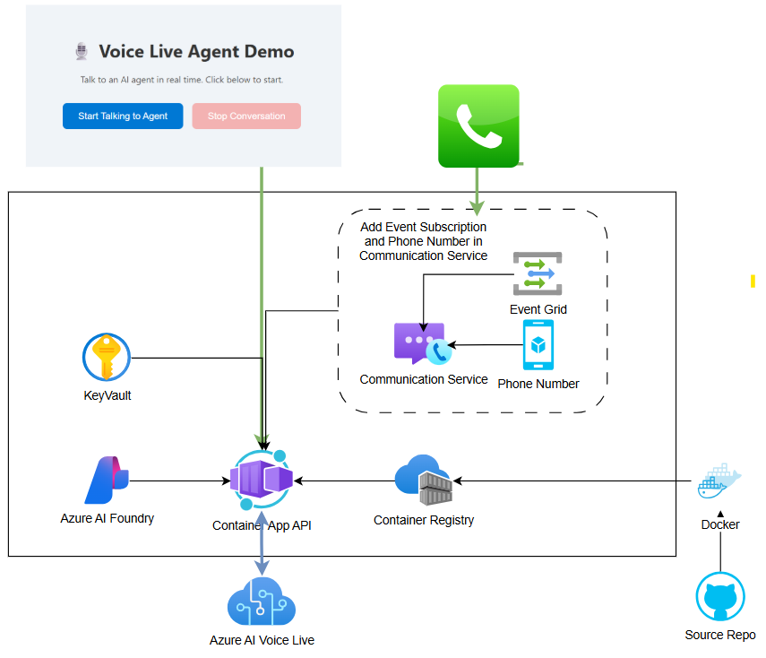
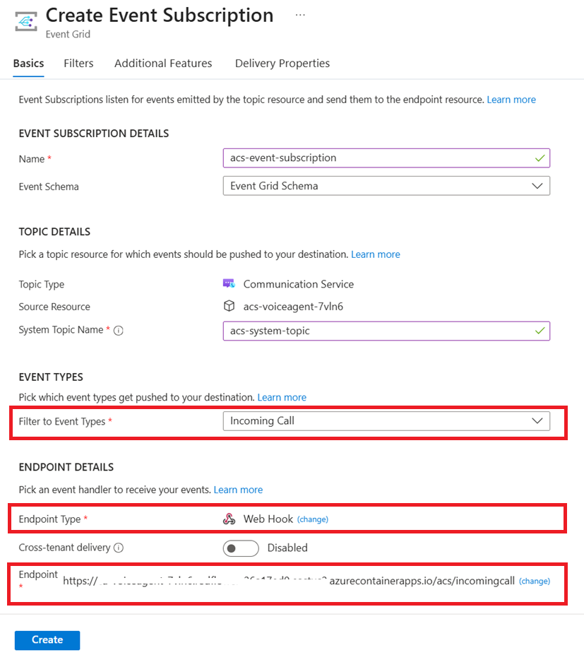

# Farmacia BOT - AI Voice Assistant with Azure Voice Live API

> **✨ Nuovo**: Setup completamente automatizzato! Vedi [AUTOMATED_SETUP.md](AUTOMATED_SETUP.md) per deployment con un comando.

> **📊 Test Logs**: I test "Simulazione Utenti" vengono salvati automaticamente su Azure Storage in formato JSON! Vedi [docs/TEST_LOGS_SETUP.md](docs/TEST_LOGS_SETUP.md) per i dettagli.

| [](https://codespaces.new/Azure-Samples/call-center-voice-agent-accelerator) | [](https://vscode.dev/redirect?url=vscode://ms-vscode-remote.remote-containers/cloneInVolume?url=https://github.com/Azure-Samples/call-center-voice-agent-accelerator)
|---|---|

Welcome to **Farmacia BOT**, an intelligent AI voice assistant for pharmacy customer service. This solution provides real-time speech-to-speech interactions in Italian, powered by **Azure Voice Live API** and integrated with **Azure Communication Services** for telephony support. The bot helps customers with product inquiries, provides pharmacy information, and delivers personalized assistance through natural-sounding Italian voices.

**Farmacia BOT** leverages Azure Voice Live API to enable low-latency, high-quality speech-to-speech interactions in Italian. The bot is specifically designed for pharmacy customer service, providing information about products (sunscreens, medications, supplements), opening hours, contact details, and general pharmacy services. Learn more about [Azure Voice Live API](https://learn.microsoft.com/azure/ai-services/speech-service/voice-live).

The solution integrates with Azure Communication Services for telephony capabilities, allowing customers to call the pharmacy and interact with the AI assistant. The bot uses Azure AI Search for RAG (Retrieval-Augmented Generation) to provide accurate, context-aware responses based on pharmacy product data. Learn more about [Azure Communication Services (Call Automation)](https://learn.microsoft.com/azure/communication-services/concepts/call-automation/call-automation).

## Multi-Environment Setup

This solution supports **two separate environments** for development and testing workflows:

- **Test Environment**: Used for development, testing new features, and validating changes before production deployment
- **Production Environment**: Production-ready environment for live customer interactions

Each environment has its own isolated Azure resources (Container Apps, Storage, AI services) managed through Azure Developer CLI (`azd`) with separate environment configurations. This ensures safe testing without affecting the production bot.

## Important Security Notice

This template, the application code and configuration it contains, has been built to showcase Microsoft Azure specific services and tools. We strongly advise our customers not to make this code part of their production environments without implementing or enabling additional security features. Learn more from [Security for Azure AI Voice Live API](https://learn.microsoft.com/azure/ai-foundry/responsible-ai/speech-service/voice-live/data-privacy-security).

### Security Considerations

ACS currently does not support Managed Identity. The ACS connection string is stored securely in Key Vault and injected into the container app via its secret URL.

<br/>

<div align="center">
  
[**Features**](#features) \| [**Getting Started**](#getting-started) \| [**Testing the Agent**](#testing-the-agent) \| [**Guidance**](#guidance) \| [**Resources**](#resources)

</div>

## Features
**Farmacia BOT** is an intelligent pharmacy assistant built with [Azure Speech Voice Live API](https://learn.microsoft.com/azure/ai-services/speech-service/voice-live) that provides real-time customer service in Italian.

### Core Capabilities:
- 🗣️ **Real-time Voice Interactions**: Natural Italian conversations using Azure Voice Live API (ASR, GPT-4o-mini, TTS)
- 🔍 **Product Search**: Integrated with Azure AI Search for accurate information about pharmacy products (sunscreens, medications, supplements)
- 📱 **Multi-Channel Support**: Web browser interface and Azure Communication Services phone integration
- 🇮🇹 **Italian Language**: Fully optimized for Italian language interactions with contextual understanding
- ⚙️ **Flexible Configuration**: Customizable prompts, voice settings, and behavior parameters

### Admin & Learning Features:
- **🆕 Admin Feedback System**: Web dashboard to review conversations, provide ratings, and approve responses
- **🔒 GDPR Compliance**: Automatic PII anonymization for Italian context (phone numbers, fiscal codes, names, medical terms)
- **📊 Analytics Dashboard**: Track conversation quality, user satisfaction, and bot performance metrics
- **🤖 Continuous Learning**: Approved responses are indexed in Azure AI Search for RAG-based improvements
- **🔐 Secure Storage**: Encrypted anonymization maps stored in Azure Key Vault with separate data access controls

> You can also try the Voice Live API via [Azure AI Foundry](https://ai.azure.com/foundry) for quick experimentation before deploying this template to your own Azure subscription.

### Pharmacy-Specific Features

**Farmacia BOT** includes specialized capabilities for pharmacy customer service:

- **Product Information**: Answer questions about sunscreens, medications, supplements, and other pharmacy products
- **Service Details**: Provide information about pharmacy opening hours, contact numbers, and services
- **Contextual Understanding**: Italian language processing optimized for medical and pharmaceutical terminology
- **Knowledge Base**: Azure AI Search integration with pharmacy product catalog (200+ products)
- **Safety & Compliance**: PII anonymization for medical information and Italian privacy regulations (GDPR)

### Admin Dashboard & Continuous Improvement

The integrated admin system enables pharmacy staff to monitor and improve bot performance:

- **Conversation Review**: Access all customer interactions with automatic PII anonymization
- **Quality Feedback**: Rate conversations and approve high-quality responses for learning
- **RAG Learning**: Approved responses are automatically indexed in Azure AI Search to improve future answers
- **Analytics**: Track conversation metrics, customer satisfaction, search usage, and response quality
- **GDPR Tools**: Data access, erasure, and retention management with audit logging

📖 **Documentation**:
- [Feedback System Implementation Summary](./FEEDBACK_SYSTEM_IMPLEMENTATION_SUMMARY.md) - Complete technical details
- [Key Vault Encryption Setup](./docs/KEY_VAULT_ENCRYPTION_SETUP.md) - Security and encryption configuration
- [Quick Reference Guide](./FEEDBACK_SYSTEM_QUICK_REFERENCE.md) - Common tasks and commands

### Architecture diagram
||
|---|

<br/>

## Getting Started


| [](https://codespaces.new/Azure-Samples/call-center-voice-agent-accelerator) | [](https://vscode.dev/redirect?url=vscode://ms-vscode-remote.remote-containers/cloneInVolume?url=https://github.com/Azure-Samples/call-center-voice-agent-accelerator)
|---|---|

### Prerequisites and Costs
To deploy this solution accelerator, ensure you have access to an [Azure subscription](https://azure.microsoft.com/free/) with the necessary permissions to create **resource groups and resources**. Follow the steps in [Azure Account Set Up](./docs/AzureAccountSetUp.md).

Check the [Azure Products by Region](https://azure.microsoft.com/explore/global-infrastructure/products-by-region/table) page and select a **region** where the following services are available: Azure AI Foundry Speech, Azure Communication Services, Azure Container Apps, and Container Registry.

Here are some example regions where the services are available: East US2, West US2, Southeast Asia, Central India, Sweden Central.
Pricing varies per region and usage, so it isn't possible to predict exact costs for your usage. The majority of the Azure resources used in this infrastructure are on usage-based pricing tiers. However, Azure Container Registry has a fixed cost per registry per day.

Use the [Azure pricing calculator](https://azure.microsoft.com/en-us/pricing/calculator) to calculate the cost of this solution in your subscription.

| Product | Description | Cost |
|---|---|---|
| [Azure Speech Voice Live ](https://learn.microsoft.com/azure/ai-services/speech-service/voice-live/) | Low-latency and high-quality speech to speech interactions | [Pricing](https://azure.microsoft.com/pricing/details/cognitive-services/speech-services/) |
| [Azure Communication Services](https://learn.microsoft.com/azure/communication-services/overview) | Server-based intelligent call workflows | [Pricing](https://azure.microsoft.com/pricing/details/communication-services/) |
| [Azure Container Apps](https://learn.microsoft.com/azure/container-apps/) | Hosts the web application frontend | [Pricing](https://azure.microsoft.com/pricing/details/container-apps/) |
| [Azure Container Registry](https://learn.microsoft.com/azure/container-registry/) | Stores container images for deployment | [Pricing](https://azure.microsoft.com/pricing/details/container-registry/) |


Here are some developers tools to set up as prerequisites:
- [Azure CLI](https://learn.microsoft.com/cli/azure/what-is-azure-cli): `az`
- [Azure Developer CLI](https://learn.microsoft.com/azure/developer/azure-developer-cli/overview): `azd`
- [Python](https://www.python.org/about/gettingstarted/): `python`
- [UV](https://docs.astral.sh/uv/getting-started/installation/): `uv`
- Optionally [Docker](https://www.docker.com/get-started/): `docker`


### Deployment Options
Pick from the options below to see step-by-step instructions for: GitHub Codespaces, VS Code Dev Containers, Local Environments, and Bicep deployments.

<details>
  <summary><b>Deploy in GitHub Codespaces</b></summary>
  
### GitHub Codespaces

You can run this solution using GitHub Codespaces. The button will open a web-based VS Code instance in your browser:

1. Open the solution accelerator (this may take several minutes):

    [](https://codespaces.new/Azure-Samples/call-center-voice-agent-accelerator)

2. Accept the default values on the create Codespaces page.
3. Open a terminal window if it is not already open.
4. Follow the instructions in the helper script to populate deployment variables.
5. Continue with the [deploying steps](#deploying).

</details>

<details>
  <summary><b>Deploy in VS Code Dev Containers </b></summary>

 ### VS Code Dev Containers

You can run this solution in VS Code Dev Containers, which will open the project in your local VS Code using the [Dev Containers extension](https://marketplace.visualstudio.com/items?itemName=ms-vscode-remote.remote-containers):

1. Start Docker Desktop (install it, if not already installed)
2. Open the project:

    [](https://vscode.dev/redirect?url=vscode://ms-vscode-remote.remote-containers/cloneInVolume?url=https://vscode.dev/redirect?url=vscode://ms-vscode-remote.remote-containers/cloneInVolume?url=https://github.com/Azure-Samples/call-center-voice-agent-accelerator)


3. In the VS Code window that opens, once the project files show up (this may take several minutes), open a terminal window.
4. Follow the instructions in the helper script to populate deployment variables.
5. Continue with the [deploying steps](#deploying).

</details>

<details>
  <summary><b>Deploy in your local environment</b></summary>

 ### Local environment

If you're not using one of the above options for opening the project, then you'll need to:

1. Make sure the following tools are installed:

    * `bash`
    * [Azure Developer CLI (azd)](https://aka.ms/install-azd)

2. Download the project code:

    ```shell
    azd init -t Azure-Samples/call-center-voice-agent-accelerator/
    ```
    **Note:** the above command should be run in a new folder of your choosing. You do not need to run `git clone` to download the project source code. `azd init` handles this for you.

3. Open the project folder in your terminal or editor.
4. Continue with the [deploying steps](#deploying).

</details>
 
### Deploying

Once you've opened the project in [Codespaces](#github-codespaces) or in [Dev Containers](#vs-code-dev-containers) or [locally](#local-environment), you can deploy **Farmacia BOT** to Azure following these steps. 

To change the `azd` parameters from the default values, follow the steps [here](./docs/customizing_azd_parameters.md). 

#### Deploy to Test Environment

1. Login to Azure:

    ```shell
    azd auth login
    ```

2. Provision and deploy all resources to the test environment:

    ```shell
    azd up --environment test
    ```
    It will prompt you to provide an environment name (use "test"), select a subscription from your Azure account, and select a location (recommended: "swedencentral"). Then it will provision the resources in your account and deploy the latest code.

3. When `azd` has finished deploying, you'll see the endpoint URI in the command output. Visit that URI to access the bot web interface! 🎉

4. When you've made changes to the app code, deploy updates with:

    ```shell
    azd deploy --environment test
    ```

#### Deploy to Production Environment

For production deployment, use a separate environment:

1. Provision and deploy to production:

    ```shell
    azd up --environment prod
    ```

2. Deploy updates to production:

    ```shell
    azd deploy --environment prod
    ```

#### Environment Management

- **Test Environment**: Use for development, testing new features, and validating changes
- **Production Environment**: Use for live customer interactions with the pharmacy bot
- Each environment maintains separate Azure resources, configurations, and data storage
- Switch between environments by specifying `--environment <name>` in `azd` commands

>[!NOTE]
>AZD will also setup the local Python environment for you, using `venv` and installing the required packages.

>[!NOTE]
>- Region: **swedencentral** is strongly recommended due to AI Foundry availability.
>- Post-Deployment: You can setup ACS Event Grid subscription and PSTN phone numbers for phone-based interactions.
>- Admin Dashboard: Access the admin feedback system at `https://<your-app-url>/static/admin/index.html`


## Testing Farmacia BOT

After deployment, you can test **Farmacia BOT** using multiple methods to verify functionality and bot performance.

### 🧪 Test Bot - Simulazione Utenti

Testa automaticamente il bot con conversazioni simulate. Accedi a `/static/test-bot.html` per:

**Nuovo Test:**
- Simulare dialoghi con diversi tipi di utenti (Collaborativo, Fuori Tema, Malevolo)
- Valutare automaticamente le risposte del bot
- Misurare accuratezza, resistenza agli attacchi e mantenimento del contesto
- **Salvare automaticamente i risultati** su Azure Storage in formato JSON

**Storico Test (✨ Nuovo):**
- Visualizzare statistiche aggregate di tutti i test eseguiti
- Filtrare test per data, accuratezza, numero dialoghi e problemi critici
- Vedere i dialoghi completi di ogni test passato
- Analizzare trend e identificare problemi ricorrenti

**I risultati dei test vengono salvati automaticamente nel container `testlogs` su Azure Storage** per analisi successive. Vedi [docs/TEST_LOGS_SETUP.md](docs/TEST_LOGS_SETUP.md) e [docs/TEST_HISTORY_FEATURE.md](docs/TEST_HISTORY_FEATURE.md) per maggiori dettagli.

### 🌐 Web Client (Interactive Testing)

Use the browser-based client to test the pharmacy bot with real voice or text interactions.

1. Go to the [Azure Portal](https://portal.azure.com) and navigate to your **Resource Group**.
2. Find and open the **Container App** resource.
3. On the **Overview** page, copy the **Application URL**.
4. Open the URL in your browser — the Farmacia BOT interface will load.
5. **Voice Mode**: Click the microphone button and speak your question in Italian (e.g., "Vendete creme solari?")
6. **Text Mode**: Type your message and press Enter to interact with the bot via text
7. The bot will respond with information about pharmacy products, hours, or services.

> 💡 Try asking about: sunscreens (creme solari), medications (farmaci), opening hours (orari), or contact information (contatto).

### 📊 Admin Dashboard

Monitor and improve bot performance through the admin feedback dashboard:

1. Navigate to `https://<your-app-url>/static/admin/index.html`
2. **Conversations Tab**: Review all customer interactions with anonymized PII
3. **Feedback Tab**: View conversation ratings and comments
4. **Analytics Tab**: Track metrics, search usage, and response quality
5. **Provide Feedback**: Rate conversations and approve responses for learning

> ⚠️ The web client is suitable for testing and demonstration. Use the ACS phone client below for production call center scenarios.


### 📞 ACS Phone Client (Production Scenario)

This enables real inbound phone calls to **Farmacia BOT** using **Azure Communication Services (ACS)**, simulating actual pharmacy customer calls.

#### 1. Set Up Incoming Call Webhook

1. In your resource group, find and open the **Communication Services** resource.
2. In the left-hand menu, click **Events**.
3. Click **+ Event Subscription** and fill in the following:

   - **Event Type**: `IncomingCall`
   - **Endpoint Type**: `Web Hook`
   - **Endpoint Address**:
     ```
     https://<your-container-app-url>/acs/incomingcall
     ```
     Replace `<your-container-app-url>` with the Application URL from your Container App.

📸 Refer to the screenshot below for guidance:



#### 2. Get a Phone Number

If you haven't already, obtain an Italian phone number for your ACS resource:

👉 [How to get a phone number (Microsoft Docs)](https://learn.microsoft.com/azure/communication-services/quickstarts/telephony/get-phone-number?tabs=windows&pivots=platform-azp-new)

#### 3. Call Farmacia BOT

Once your event subscription is configured and the phone number is active:

- Dial the ACS phone number from any phone.
- Your call will connect to **Farmacia BOT** powered by Azure Voice Live.
- Speak in Italian to ask about pharmacy products, hours, or services.
- The conversation will be automatically logged and available in the admin dashboard for review.


#### Local execution

Once the environment has been deployed with `azd up` you can also run the application locally.

Please follow the instructions in [the instructions in `service`](./service/README.md)

<br/>

## Guidance

### Responsible AI Transparency FAQ 

Please refer to [Transparency Note](https://learn.microsoft.com/azure/ai-foundry/responsible-ai/speech-service/voice-live/transparency-note) for responsible AI transparency details of the voice live api.

### Resource Clean-up

When you no longer need the resources created in this article, run the following command to power down the app:

```bash
azd down
```

If you want to redeploy to a different region, delete the `.azure` directory before running `azd up` again. In a more advanced scenario, you could selectively edit files within the `.azure` directory to change the region.

<br/>

## Resources
- [📖 Docs: Voice live overview](https://learn.microsoft.com/azure/ai-services/speech-service/voice-live)
- [📖 Blog: Upgrade your voice agent with Azure AI Voice Live API](https://techcommunity.microsoft.com/blog/azure-ai-foundry-blog/upgrade-your-voice-agent-with-azure-ai-voice-live-api/4458247)
- [📖 Docs: Azure Speech](https://learn.microsoft.com/azure/ai-services/speech-service/)
- [📖 Docs: Azure Communication Services (Call Automation)](https://learn.microsoft.com/azure/communication-services/concepts/call-automation/call-automation)
